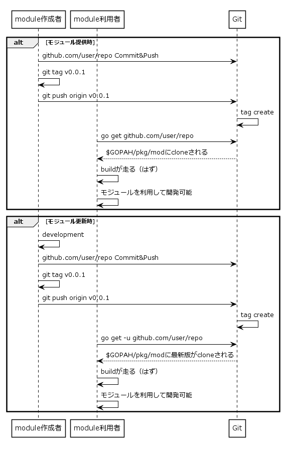

# パッケージ管理（内部管理）

## パッケージ管理の方法
- パッケージというよりは、`Modules`を利用するならばモジュールという呼称としたほうが良いと思われる。
- Gitリポジトリ一択  
- `Modules`としてもサポートしている。

## 利用シーケンス

## バージョニング
セマンティックバージョニングが推奨されている。  
どこをどう使うかはプロジェクトで判断ポイント。